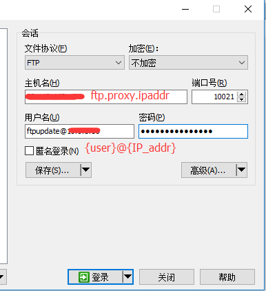

# ftp.proxy
1. FTP Proxy 官方文档
[FTP proxy](http://www.ftpproxy.org/)
[FTP help](http://www.ftpproxy.org/en/ftp.proxy-1.html)

2. FTP Proxy install
```bash
[root@smallasa ~]# yum -y install ctags
[root@smallasa ~]# wget http://www.ftpproxy.org/download/ftpproxy-1.2.3.tgz
[root@smallasa ~]# tar xzf ftpproxy-1.2.3.tgz
[root@smallasa ~]# cd ftpproxy-1.2.3
[root@smallasa ftpproxy-1.2.3]# make
[root@smallasa ftpproxy-1.2.3]# make install

[root@smallasa ftpproxy-1.2.3]# mkdir -p /mnt/app/ftp_proxy
[root@smallasa ftpproxy-1.2.3]# cp /usr/local/sbin/ftp.proxy /mnt/app/ftp_proxy
```

3. FTP Proxy start
```bash
[root@smallasa ~]# /mnt/app/ftp_proxy/ftp.proxy -D 10021 -e -l -m -t 1800

-D 10021  指定端口为10021
-e        启用客户端服务器选择(非常重要),通常我们的ftp账号为ftpuser这种,那么使用此参数后,我们可以访问后端的某台服务器,比如192.168.1.15,使用的账号名变成:ftpuser@192.168.1.15
-l        Logging
-m        monitor mod
-t 1800   超时时间
```

4. 通过ftp.proxy登录FTP
```bash
文件协议 : FTP
主机名   : {ftp.proxy.ipaddr}:{ftp.proxy.port}
用户名   : {ftp.user}@{ftp.real.ipaddr}
密码     : {ftp.user.passwd}
```


5. 将ftp.proxy加入到systemd
```bash
[root@smallasa ftp_proxy]# cat > /mnt/app/ftp_proxy/ftpproxy.conf <<EOF
> #代理服务器监听端口。
> BIND_PORT=10021
> #其他选项
> #-e 启用客户端服务器选择（非常重要），通常我们的ftp账号为ftpuser这种，那么使用此参数后，我们可以访问后端的某台服务器，比如192.168.1.15,使用的账号名变成:ftpuser@192.168.1.15
> #-l Logging
> #-t 1800 超时时间
> OPTIONS='-e -l -m -t 1800'
> EOF

[root@smallasa ftp_proxy]# cat > /usr/lib/systemd/system/ftpproxy.service <<EOF
> [Unit]
> Description=Ftp proxy server daemon
> After=network.target
>
> [Service]
> Type=forking
> EnvironmentFile=/mnt/app/ftp_proxy/ftpproxy.conf
> ExecStart=/mnt/app/ftp_proxy/ftp.proxy  -D $BIND_PORT $OPTIONS
>
> [Install]
> WantedBy=multi-user.target
> EOF

[root@smallasa ftp_proxy]# systemctl enable ftpproxy.service
[root@smallasa ftp_proxy]# systemctl start  ftpproxy.service
```
